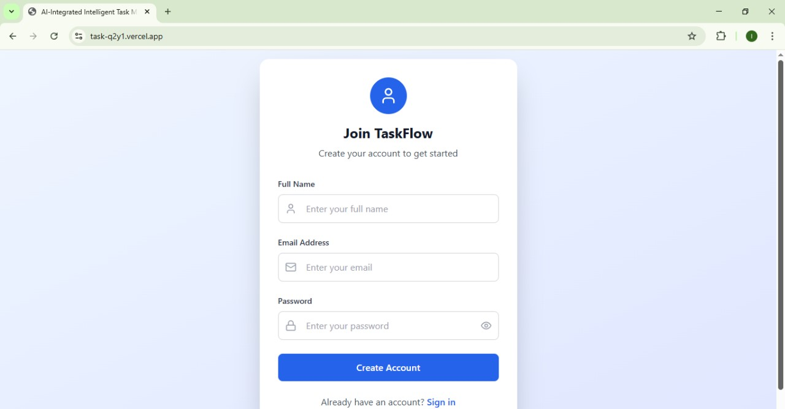
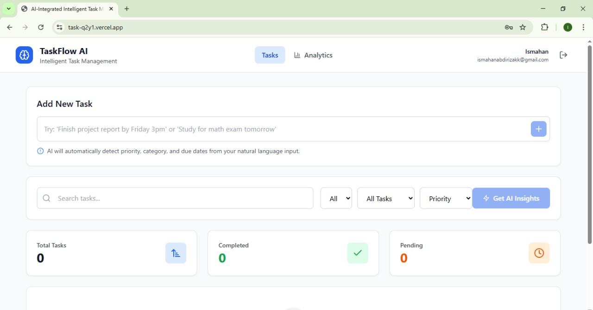
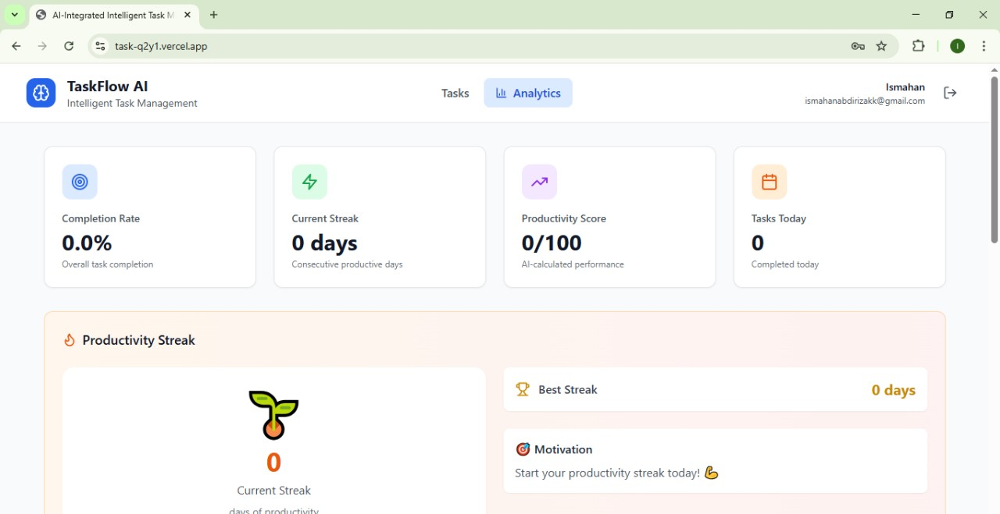

## Task Manager

### A clean, fast, focused productivity app 

This is a minimal, fast React app for planning tasks, tracking progress, and maintaining healthy streaks. It uses Supabase for auth, database, and realtime updates, and Vite for a super quick developer experience.

### Live Demo
- Production: [task-q2y1.vercel.app](https://task-q2y1.vercel.app/)

---

### Screenshots

Login


Tasks


Analytics


---

### Features
- **Tasks**: create, edit, complete, delete
- **Realtime**: updates sync instantly across tabs/devices
- **Priorities**: low, medium, high, urgent
- **Categories**: keep work/study/life organized
- **Deadlines**: optional due dates
- **Streaks**: daily completion streak and longest streak
- **Analytics**: simple charts and quick insights
- **AI insights**: lightweight suggestions and motivational nudges

---

### Tech Stack
- **Frontend**: React + TypeScript + Vite
- **Styling**: Tailwind CSS (plus a few small UI icons via `lucide-react`)
- **Backend**: Supabase (Postgres, Auth, Realtime)
- **AI**: simple service layer that connects to an LLM provider

---

### Project Structure
```
src/
  components/
    Analytics/
      AnalyticsDashboard.tsx
      MetricsCards.tsx
      StreakTracker.tsx
  hooks/
    useTasks.ts
  lib/
    supabase.ts
  services/
    authService.ts
    taskService.ts
    analyticsService.ts
    aiService.ts
  types/
    index.ts

supabase/
  (SQL files live at repo root for now; see schema files)
```

---

### Local Setup
1) Install dependencies
```bash
npm install
```

2) Environment variables (Vite requires the `VITE_` prefix)
```env
VITE_SUPABASE_URL=
VITE_SUPABASE_ANON_KEY=
```
Create `.env` locally (don’t commit it). Commit `.env.example` so others know what to fill in.

3) Start the dev server
```bash
npm run dev
```

4) Optional: build
```bash
npm run build
```

---

### AI
The app includes a small AI layer for insights and gentle prompts. It’s intentionally minimal: no heavy pipelines, just focused helpers where they add value.

Built after learning Prompt AI — my first build using that workflow.

---

### Supabase Notes
- Make sure your `tasks` table uses `timestamptz` for `created_at` / `updated_at`.
- Row Level Security (RLS) is enabled so users only see their own tasks.
- SQL helpers in the repo:
  - `supabase-schema.sql`
  - `simple-schema.sql`
  - `migrate-to-userid.sql`
  - `fix-rls.sql`

You can run these in the Supabase SQL editor. For streak analytics, there’s also an optional RPC approach.

---

### Scripts
- `dev`: start Vite locally
- `build`: production build
- `preview`: preview the production build locally

---

### Commit Style
Commits are small and purposeful. Examples:
- `add Supabase client`
- `task service (CRUD + realtime)`
- `analytics + streak calculation`
- `correct current streak calculation`
- `add SQL schemas and migrations`

Occasionally, multiple small changes are batched with a single clear message.

---

### Roadmap
- Integrate server-calculated streaks via Supabase RPC (optional)
- Better charts and filtering
- Keyboard shortcuts for power use
- Offline-friendly mode

---

### Motivation
The goal is a lightweight tool that encourages consistency without getting in the way—simple, fast, and calm.

---

### Contributing / Feedback
If you spot something odd or have an idea, open an issue. PRs are welcome.

---

### License
MIT — use, learn, remix.


